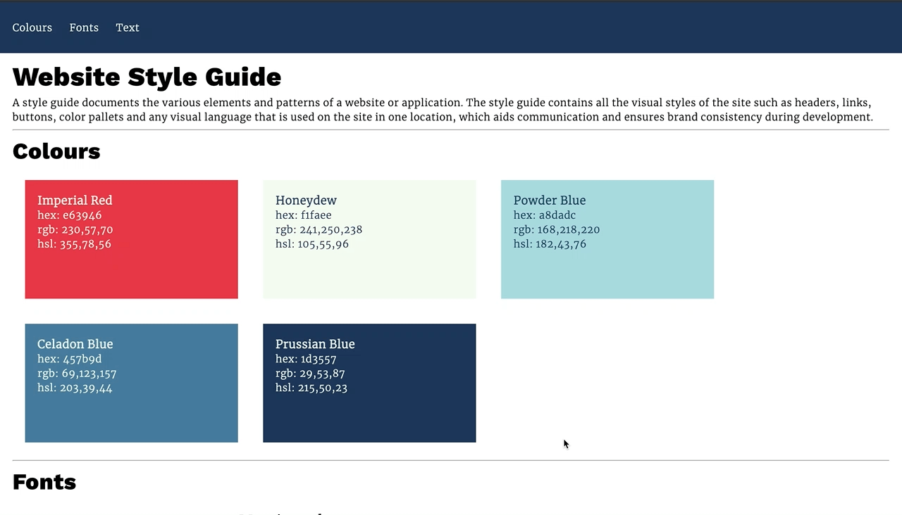

# Website Design System
> This project is a for building a website style guide/design system.

## Table of contents
* [General info](#general-info)
* [Screenshots](#screenshots)
* [Technologies](#technologies)
* [Features](#features)
* [Status](#status)
* [Inspiration](#inspiration)

## General info
This project was created as part of the codecademy Fullstack path, where the objective was to build a style
guide/design system.

This at least should include a section on colors, fonts, and text styles.

## Screenshots

## Technologies
* HTML
* CSS

## Features

* Base Colours
* Fonts
* Base Text Styles

To-do list:
* Components
  ** Buttons
  ** Navbar
  ** Cards

## Status
Project is: in progress

## Inspiration
Project based on the Codecademy Fullstack path Build a Website Design System Project.